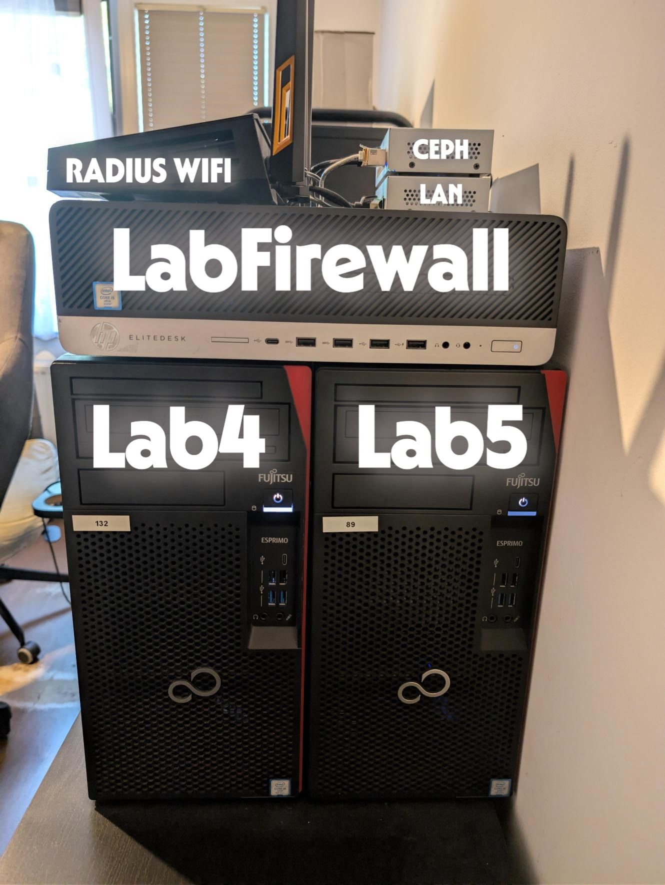
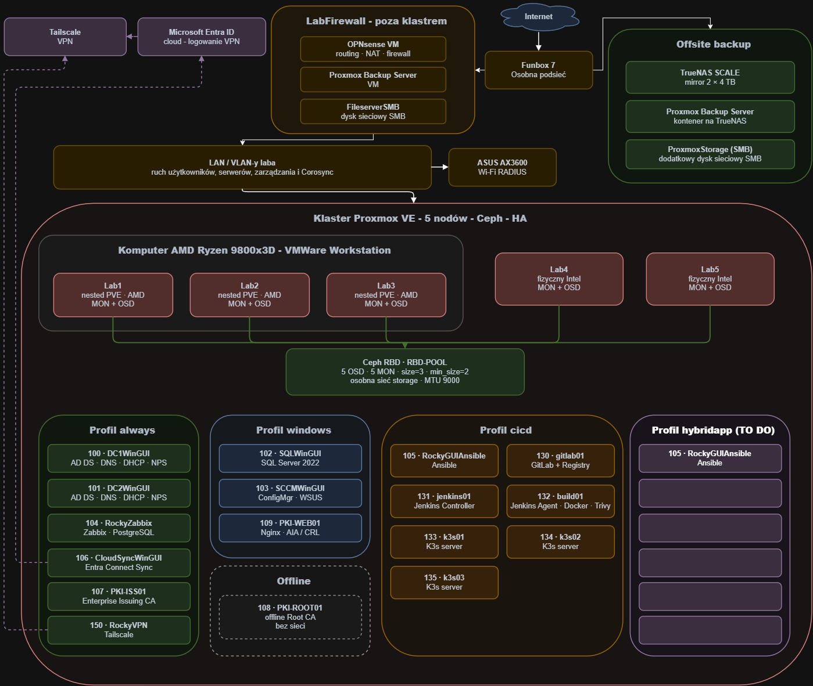

# Enterprise Infrastructure Lab

To home lab zbudowany do nauki administracji Windows i Linux, wirtualizacji, sieci, automatyzacji oraz CI/CD. Całość działa na klastrze Proxmox VE z Ceph.

Repozytorium zawiera krótki opis środowiska, używane playbooki Ansible, skrypty bash oraz testową aplikację z pipelineem Jenkinsa.



# Sprzęt

| Ilość | Urządzenie | Procesor | RAM | Dyski | Sieć | Zastosowanie |
|---:|---|---|---:|---|---|---|
| 1 | Główny komputer AMD | AMD Ryzen 7 9800X3D | 64 GB | 3 × NVMe SSD; każdy z nodów `Lab1`–`Lab3` ma 200 GiB na system i 460 GiB na OSD Ceph | 10 GbE dla Ceph, 3 x 2.5 GbE dla LAN, 2.5 GbE dla zarządzania | VMware Workstation i trzy zagnieżdżone nody Proxmox: `Lab1`, `Lab2`, `Lab3` |
| 1 | Fujitsu P957 — `Lab4` | Intel Core i5-7600 | 16 GB | NVMe SSD 128 GB na Proxmox, SSD 500 GB na Ceph | 2.5 GbE dla Ceph, 2.5 GbE dla LAN, 1 GbE dla zarządzania | Fizyczny node Proxmox |
| 1 | Fujitsu P957 — `Lab5` | Intel Core i5-7600 | 16 GB | NVMe SSD 128 GB na Proxmox, SSD 500 GB na Ceph | 2.5 GbE dla Ceph, 2.5 GbE dla LAN, 1 GbE dla zarządzania | Fizyczny node Proxmox |
| 1 | HP EliteDesk 800 G3 — `LabFirewall` | Intel Core i5-6500 | 16 GB | SSD 256 GB, 2 TB HDD, 500 GB HDD | 2 x 10 GbE LAN, 2.5 GbE WAN, 1 GbE dla zarządzania | Proxmox z OPNsense, Proxmox Backup Server i zasobem SMB |
| 1 | Komputer TrueNAS | Intel Core i5-2500K | 16 GB | SSD 256 GB na system, 2 × HDD 4 TB w mirrorze | 2.5 GbE | TrueNAS SCALE, zapasowy zasób SMB i kontener Proxmox Backup Server w innej podsieci |
| 2 | HORACO HC-SWTGW218AS | — | — | — | 10 GbE, 8 x 2.5 GbE | Jeden switch dla Ceph z MTU 9000, drugi dla głównej sieci VM |
| 1 | HORACO ZX310S-8T2XS | — | — | — | 2 x 10 GbE, 8 x 2.5 GbE | Switch do sieci management |
| 1 | Router ASUS AX3600 | — | — | — | 1 GbE i Wi-Fi | Dostęp bezprzewodowy do sieci laboratoryjnej i logowanie przez RADIUS/NPS |
| 1 | Router FunBox | — | — | — | — | Łącze z Internetem i osobna podsieć, do której jest podłączony host TrueNAS |

## Co działa w labie

```
- pięć nodów Proxmox VE, Corosync, HA i migracje maszyn
- Ceph RBD z pięcioma OSD, replikacją `size=3` i osobną siecią storage
- dwa kontrolery domeny z AD DS, DNS, DHCP failover, GPO i NPS/RADIUS
- SQL Server, Microsoft Configuration Manager, WSUS i Entra Connect Sync
- Root CA offline, Issuing CA oraz serwer Nginx publikujący AIA i CRL
- automatyczne tworzenie VM Rocky Linux z cloud-init
- zarządzanie serwerami Linux przez Ansible
- GitLab CE, prywatny Container Registry, Jenkins i osobny agent build
- trzywęzłowy K3s z embedded etcd, kube-vip, MetalLB i NGINX Ingress
- pipeline budujący, testujący, skanujący i wdrażający testową aplikację SecureHash
- Zabbix dla serwerów oraz Prometheus i Grafana dla K3s
- OPNsense, osobna sieć Ceph i zdalny dostęp przez Tailscale
- backupy VM do Proxmox Backup Server
- skrypty przełączające zasoby HA pomiędzy profilem `windows` i `cicd`
```

## Schemat



## Technologie uzyte w projekcie

| Obszar | Technologie |
|---|---|
| Wirtualizacja | Proxmox VE 9, VMware Workstation |
| Storage i backup | Ceph Squid, TrueNAS SCALE, Proxmox Backup Server |
| Bazy | PostgreSQL, SQL Server 2022 |
| Windows | Windows Server 2025, AD DS, DNS, DHCP, NPS, GPO, AD CS, PowerShell, Configuration Manager, WSUS, Entra Connect Sync |
| Linux | Rocky Linux 10, Ansible, Bash |
| Sieć | OPNsense, Tailscale |
| CI/CD | GitLab CE, Jenkins, Docker, Trivy |
| Kubernetes | K3s, Helm, MetalLB, NGINX Ingress |
| Aplikacja | Python, FastAPI, React, Vite, Nginx |
| Monitoring | Zabbix, Prometheus, Grafana |

## Zawartość repozytorium

| Katalog | Co zawiera |
|---|---|
| [`proxmox/`](proxmox/) | klaster, Ceph, HA, nested virtualization i profile VM |
| [`windows/`](windows/) | AD, DNS, DHCP, NPS, PowerShell, SQL, SCCM, Entra Connect i PKI |
| [`linux/`](linux/) | Rocky Linux, Ansible, platforma CI/CD |
| [`monitoring/`](monitoring/) | Zabbix oraz monitoring K3s |
| [`networking/`](networking/) | OPNsense, sieć Ceph i Tailscale |
| [`backup/`](backup/) | TrueNAS, PBS i polityka wykonywania kopii |
| [`troubleshooting/`](troubleshooting/) | problemy napotkane podczas budowy laba |

## Instalacja Rocky Linux 10 + Zabbix client (Bash+Ansible)

[](https://www.youtube.com/embed/Sv48lFKTrDY)

Opis w
[`linux/README.md`](linux/README.md), oraz
[`linux/ansible/README.md`](linux/ansible/README.md)

## Profile Windows i CI/CD

Sprzęt nie pozwala wygodnie uruchamiać wszystkich maszyn naraz. Profile wyłączają jeden zestaw VM i włączają drugi:

```bash
/mnt/pve/FileserverSMB/scripts/profil-windows.sh
/mnt/pve/FileserverSMB/scripts/profil-cicd.sh
/mnt/pve/FileserverSMB/scripts/profil-status.sh
```

[](https://www.youtube.com/embed/Up8BLP5pXxE)

Opis i skrypty znajdują się w
[`proxmox/profile-switching.md`](proxmox/profile-switching.md).

## Pipeline aplikacji SecureHash

```text
commit lub Merge Request
- GitLab wysyła webhook do Jenkinsa
- quality gate
- skany Trivy
- budowa i wysłanie obrazów do Registry
- wdrożenie brancha main do K3s
- rolling update
- test aplikacji
- rollback przy błędzie
```

[](https://www.youtube.com/embed/6pclmimSptk)

Dokładniejszy opis jest w
[`linux/cicd/README.md`](linux/cicd/README.md).

## Kilka uwag

- `Lab1`–`Lab3` są zagnieżdżone w VMware na jednym komputerze AMD, a `Lab4` i `Lab5` to dwa fizyczne komputery Intel
- cold migration działa pomiędzy wszystkimi nodami, natomiast live migration Windows z nested AMD do Intel kończy się błędem `MEMORY_MANAGEMENT`
- dokumentacja była nadrabiana z dużym opóźnieniem z pamięci stąd opisy przede wszystkim architektury Windowsa mogą nie być kompletne


# 29.08.2026 Co dalej

## Aktualnie:

- Przygotowuję się do certyfikatu RHCSA EX200 (Red Hat Certified System Administrator)

## W przyszłości:

- Do poprawy VLANy wraz z docelowym podziałem sieci na Management, VM i Ceph - wymaga zmiany adresacji wielu maszyn
- W dalszej przyszłości planuję dodać projekt w architekturze hybrydowej Azure + on-prem, np. skracacz linków z frontendem i publiczną bramą w Azure oraz backendem z PostgreSQL działającym na K3s/K8s i korzystającym z Ceph CSI. Połączenie między chmurą a labem będzie realizowane przez Tailscale, a infrastruktura Azure zarządzana za pomocą Terraforma