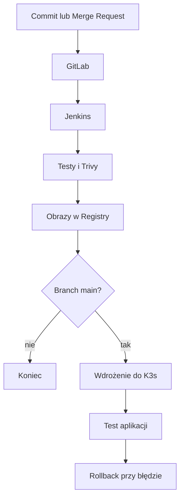

# CI/CD i SecureHash

Ta część laba pokazuje drogę zmiany od commita w GitLabie do uruchomienia
nowej wersji aplikacji w K3s. Jenkins wykonuje testy, buduje obrazy, wysyła je
do prywatnego Registry i wdraża branch `main`.

SecureHash jest małą aplikacją testową. Użytkownik podaje tekst, a backend
zwraca jego hash bcrypt. Aplikacja nie ma bazy danych.

## Maszyny i usługi

| Element | Gdzie działa | Zadanie |
|---|---|---|
| GitLab CE | `gitlab01` | repozytorium i Merge Requesty |
| Container Registry | `gitlab01` | prywatne obrazy Docker |
| Jenkins Controller | `jenkins01` | uruchamianie pipeline'u |
| Jenkins Agent | `build01` | testy, Trivy, Docker i kubectl |
| K3s | `k3s01`–`k3s03` | uruchamianie aplikacji |
| kube-vip | K3s | wspólny adres Kubernetes API |
| MetalLB | K3s | adres dla usług `LoadBalancer` |
| NGINX Ingress | K3s | dostęp HTTPS do aplikacji |

## Jak działa pipeline



Pipeline ma następujące etapy:

1. Jenkins pobiera kod i tworzy tag obrazu.
2. Uruchamiany jest quality gate.
3. Trivy skanuje repozytorium oraz obrazy backendu i frontendu.
4. Oba obrazy są wysyłane do GitLab Container Registry.
5. Dla brancha `main` obrazy dostają też tag `main`.
6. Jenkins aktualizuje najpierw backend, a później frontend w K3s.
7. Po wdrożeniu sprawdzane są `/healthz` i `/api/health` przez HTTPS.
8. Gdy wdrożenie lub test się nie uda, wracają poprzednie obrazy.

Każdy branch przechodzi testy, skany i budowę obrazów. Tylko `main` jest
wdrażany do K3s.

## Co dokładnie sprawdza quality gate

Skrypt `securehash/scripts/quality-gate.sh` wykonuje:

1. `docker compose config --quiet` — sprawdzenie pliku Compose;
2. budowę testowego obrazu backendu;
3. lint i produkcyjny build frontendu;
4. budowę końcowych obrazów przez Docker Compose.

W obrazie testowym backendu uruchamiane są:

- `ruff check` dla kodu i testów;
- `ruff format --check`;
- `pytest`;
- coverage z wymaganym wynikiem co najmniej 90%.

Testy backendu sprawdzają:

- odpowiedź głównego endpointu `/`;
- odpowiedź health check `/health`;
- utworzenie hasha bcrypt przez `/hash`;
- przyjęcie hasła mającego dokładnie 72 bajty UTF-8;
- odrzucenie pustego hasła;
- odrzucenie hasła dłuższego niż 72 bajty;
- liczenie bajtów UTF-8 zamiast samej liczby znaków.

Frontend podczas budowy wykonuje `npm ci`, `oxlint` i `vite build`. Nie ma
osobnych testów jednostkowych frontendu.

Jeśli którykolwiek z tych kroków zwróci błąd, pipeline kończy się przed
wysłaniem obrazów.

## Trivy

Trivy skanuje:

- pliki repozytorium, zależności, konfigurację i możliwe sekrety;
- obraz backendu;
- obraz frontendu.

Raport obejmuje problemy `HIGH` i `CRITICAL` i trafia do katalogu `reports/`.
W tej wersji wyniki są raportowane, ale nie zatrzymują pipeline'u.

## Obrazy i deployment

Obrazy mają tag wskazujący konkretny commit:

```text
backend:<12-znakowy-SHA>
frontend:<12-znakowy-SHA>
```

Jenkins używa osobnego ServiceAccount w namespace `securehash`. Może czytać
stan podów i Deploymentów oraz zmieniać tylko Deploymenty `backend` i
`frontend`.

Backend i frontend mają po trzy repliki. Kubernetes rozkłada repliki tego
samego elementu na różnych nodach. Oba Deploymenty mają startup, readiness
i liveness probes.

## Klaster K3s

`k3s01` tworzy klaster z `cluster-init`, a `k3s02` i `k3s03` dołączają do
embedded etcd. Wbudowany Traefik i ServiceLB są wyłączone, ponieważ lab używa
NGINX Ingress i MetalLB.

Snapshot embedded etcd wykonywany jest co 6 godzin, a przechowywanych jest
14 kopii.

Pliki do ustawienia platformy znajdują się w
[`infrastructure/ansible/`](infrastructure/ansible/), a kod aplikacji w
[`securehash/`](securehash/).
