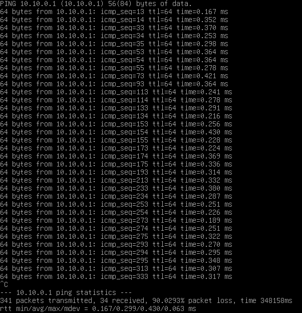
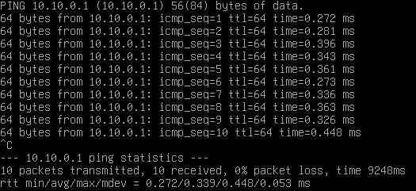

# PBS – utrata pakietów przez konflikt IP z API Kubernetes

## Objaw

PBS tracił pakiety do OPNsense i pozostałych maszyn w LAN-ie.
Pierwsze 2 pakiety przechodziły poprawnie, następne 20–30 było traconych,
po czym ponownie przechodziły 2 pakiety. Cykl powtarzał się przez cały test.




## Diagnostyka

- Inne maszyny uzywające tej samej karty sieciowej działały poprawnie.
- Sprawdzone adresy MAC kart VM – nie powtarzały się.
- W tablicy ARP OPNsense adres IP PBS był przypisany do innego MAC niż karta PBS.
- Sprawdzenie adresacji wykazało, że ten sam IP był używany przez API Kubernetes.

## Przyczyna

Konflikt adresów IP między PBS a API Kubernetes.
Adres IP PBS był kojarzony z MAC innego urządzenia, przez co ruch do PBS
nie trafiał prawidłowo i występowały okresowe przerwy w komunikacji.

## FIX

Adres PBS zmieniony na `10.10.0.221/24`:

```bash
proxmox-backup-manager network update nic0 --cidr 10.10.0.221/24
```

Poprawione również wpisy w `/etc/hosts`, które przypisywały nazwę PBS
do starego adresu IP:

```bash
nano /etc/hosts
```

Po zastosowaniu konfiguracji sieciowej zaktualizowany adres PBS
w konfiguracji połączeń maszyn korzystających z serwera backupu.

## Weryfikacja

Na nowym adresie PBS działa poprawnie. Ponowne testy ping do OPNsense
i pozostałych maszyn nie wykazały utraty pakietów.

