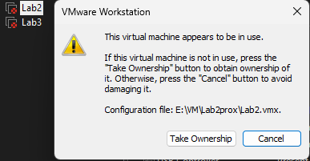

# VMWare VM in use error

Po niepoprawnym wyłączeniu maszyn Proxmox w VMWare Workstation stara sesja wyświetla się nadal jako aktywna.

# FIX

Przejmowanie kontroli nic nie da, bo w rzeczywistości maszyna jest wyłączona, trzeba wejść do folderu z dyskiem VM i usunąć pliki z rozszerzeniem '.lck'.
Najlepiej przed tym zrobić pełny backup.